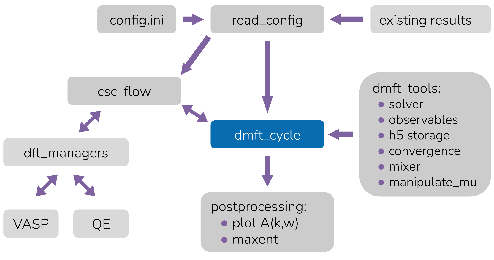

.. _documentation:

***************
documentation
***************

code structure:
===============

more details in the reference manual below.

DFT code interfaces
===================

.. toctree::
   md_notes/w90_interface.md
   md_notes/vasp_csc.md

run solid_dmft
===================
   
   .. toctree::
      md_notes/docker.md
      md_notes/run_locally.md
      md_notes/run_cluster.md

module reference manual
=======================

.. toctree::
   :maxdepth: 4

   reference/csc_flow
   reference/dft_managers
   reference/dmft_cycle
   reference/dmft_tools
   reference/postprocessing
   reference/read_config
   reference/util

