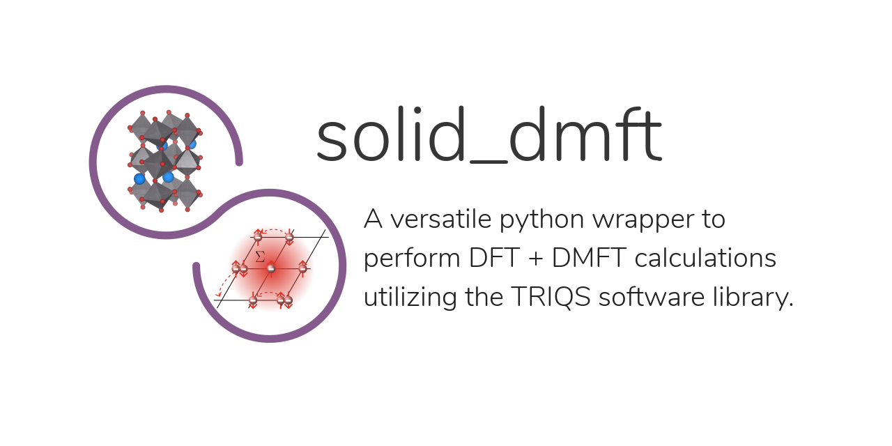

.. index:: solid_dmft

.. module:: solid_dmft

solid_dmft
=========

   This is the homepage of solid_dmft v3.0.0.
   For changes see the :ref:`changelog page <changelog>`.

This :ref:`TRIQS-based <triqslibs:welcome>`-based application is aimed at ab-initio calculations for 
correlated materials, combining realistic DFT band-structure calculations with the dynamical mean-field theory. Together with the

Learn how to use solid_dmft in the :ref:`documentation`.

.. toctree::
   :maxdepth: 2

   install
   reference
   issues
   changelog
   about
