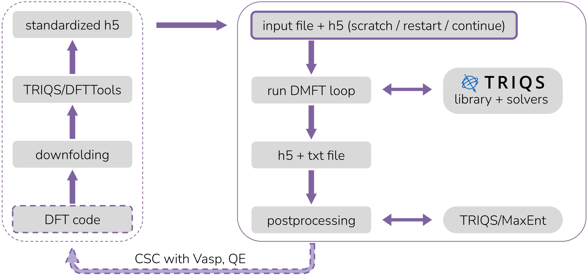

.. index:: solid_dmft

.. module:: solid_dmft

solid_dmft
**********

.. sidebar:: solid_dmft |PROJECT_VERSION|

   This is the homepage of solid_dmft |PROJECT_VERSION|.
   For changes see the :ref:`changelog page <changelog>`.
   visit us on:
      
      .. image:: _static/logo_github.png
         :width: 60%
         :align: center
         :target: https://github.com/flatironinstitute/solid_dmft

This program allows to perform DFT+DMFT ''one-shot'' and charge self-consistent
(CSC) calculations from h5 archives or VASP/Quantum Espresso input files for
multiband systems using the TRIQS software library, and the DFT code interface 
`TRIQS/DFTTools <https://triqs.github.io/dft_tools>`_. Works with triqs >3.x.x. 
solid_dmft takes advantage of various impurity solvers available in triqs: cthyb, 
HubbardI, ForkTPS, ctint, and ctseg. Postprocessing scripts are available to 
perform analytic continuation and calculate spectral functions. 

For installation use the same branch / tag as your triqs installation. More
information under :ref:`installation`. 

Learn how to use solid_dmft in the :ref:`documentation` and the :ref:`tutorials`.

Workflow of DFT+DMFT calculations with solid_dmft
=================================================

------------

.. toctree::
   :maxdepth: 2
   :hidden:

   install
   documentation
   tutorials
   issues
   ChangeLog.md

.. image:: logos/flatiron.png
   :width: 300
   :align: left
   :target: https://www.simonsfoundation.org/flatiron/center-for-computational-quantum-physics

