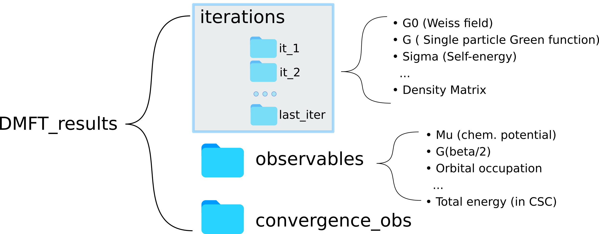

*************************************
Output / results
*************************************
The *DMFT_results* group contains the output of the DMFT iterations. The subgroups contained here fall under two main categories:

* **Iterations**: relevant quantities for the DMFT solutions, such as Weiss field, Green function, extracted self-energy, etc.
  Normally these are solver dependent.

* **Observables**: Single-particles quantities that can be measured with the aid of the green function. Includes chemical potential, estimate of the quasiparticle weight, impurity occupation, total energy, energy contributions, etc. The convergence_obs subgroup lists the stepwise difference in the observables' value as the calculation progresses and can be used as a proxy for convergence.

Group structure
===============

Subgroups
===================
.. toctree::
    :maxdepth: 1

    iterations
    observables

