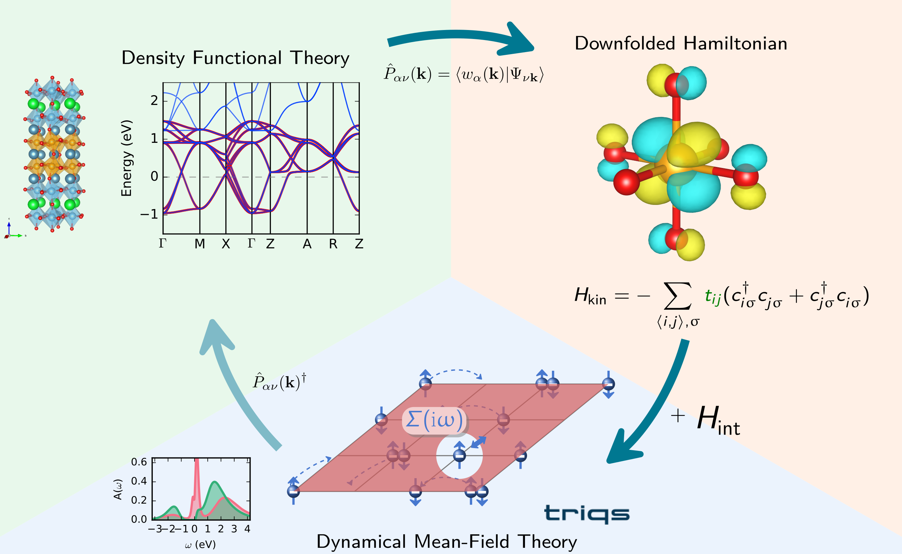

# Summary

solid\_dmft is a MPI parallelized scientific simulation code written in Python 3, allowing to perform ab-initio density functional theory (DFT) plus dynamical mean-field theory (DMFT) calculations.
The software is utilizing the TRIQS software library [@triqs:2015],handling most numerical operations. 
Although, DMFT has been very successfully in describing correlated electron systems for over two decades, ready to use software packages are only available very recently, with most scientific research carried out by self-written codes in research groups.   
The aim of solid\_dmft is to provide such ready to use implementation, to increase reproducibility of results, provide clearer convergence metrics, and being able run DMFT calculations for all kind of systems without adapting the code manually, very similar to widely available DFT simulation packages. 
Hence, the targeted user group are researchers that aim to perform DMFT calculations on top of their DFT simulations to describe the physics of strongly correlated electron systems, without the need of elaborate coding, but rather using a standardized input file to control the calculation. 

DFT calculations are performed with one of the TRIQS/DFTTools [@dfttools:2016] compatible codes, with a fully charge self-consistent (CSC) interface implemented for Quantum Espresso and the Vienna ab-initio simulation package (VASP). 
The DFT output is converted by TRIQS/DFTTools into a HDF archive in a standardized structure to be read by solid_dmft. 

## Design Principles

The code is designed to run with any input DFT calculation or model system providing a low energy (downfolded) description of the periodic solid system.
This can be either provided directly as Hamiltonian in reciprocal $\mathbf{k}$ space or as overlap between localized basis functions and the DFT wave function (projectors), and their eigenvalues. 
Furthermore, the code is designed to be modular, relying on triqs functionalities to perform basic operations, and is mend to be easily extendable to add new features.
Therefore, we split each part of the simulation into separate stand-alone functions, to limit statefulness to a minimum.
The only python class of solid\_dmft is a so called `solver` class to solve the occurring impurity problem in the DMFT loop. 
This class implements the various impurity solvers available in triqs: cthyb, HubbardI, ForkTPS, ctint, and ctseg.
Even though, these solvers operate very differently solid\_dmft allows to seamlessly switch impurity solvers, with a simple input flag.

solid\_dmft allows also to perform inhomogenous DMFT calculations, i.e. treatment of multiple correlated and uncorrelated shells (impurity problems), converging one shared dynamic Weiss field. 
After self-consistency is reached, either via full CSC, or just within the DMFT cycle, postprocessing scripts are available to perform analytic continuation of imaginary Green's functions and to calculate spectral functions. 

{ width=100% }

The idea is to provide the full functionality of a full a DFT+DMFT calculation, bringing together the state-of-the-art implementations provided by the triqs library and its applications. 
This allows to implement and test new features of triqs or benchmark new solvers against existing ones.
The full DFT+DMFT cycle is presented in \autoref{fig:downfolding}. 
solid\_dmft can run the DFT calculations, create the downfolded Hamiltonian, solve the resulting Hubbard like Hamiltonian via DMFT, post-process the data to calculate physical meaningful observables, and allow the charge corrected feedback via CSC.

The modularity of the program also allows to run for example only the DMFT loop via a single function with well defined input and output without running solid_dmft as a monolithic code, making it easy to be used in other projects.

As of now solid\_dmft has been successfully used in various peer reviewed research studies[@Beck:2022], and provides stable releases matching the releases of the TRIQS library, that are well tested. We provide a full documentation including tutorials, and a reference manual. Furthermore, we utilize an extensive CI workflow on github to test every PR and commit.

# Statement of need

As already mentioned the number of ready to use DFT+DMFT codes is rather limited, and all codes are rather recent. Most of them are completely black boxed, e.g. EDMFT, Amulet, DMFT implementation in Abinit. Other implementation like DFTwDMFT and DCORE follow a very similar strategy but do not implement different impurity solvers as of now. solid\_dmft provides a flagship implementation of the TRIQS functionality to perform DFT+DMFT calculation and is ready to be extend to beyond DMFT formalisms. This is beneficial both for developers of TRIQS applications, by enabling them to test their applications in a well tested framework, and for users, as they benefit of the most recent features of TRIQS.

# Acknowledgements

The Flatiron Institute is a division of the Simons Foundation.

# References
