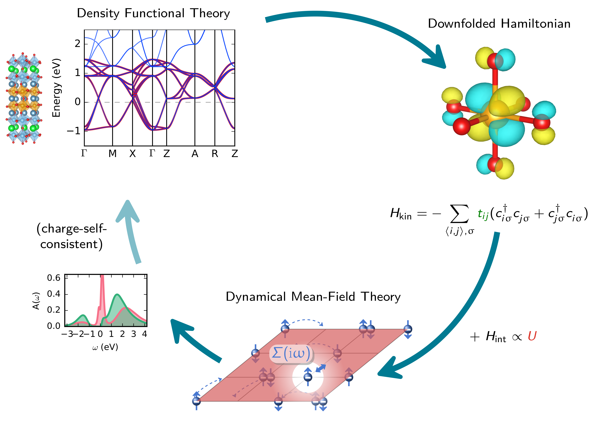

# Summary

* target user group
* has the functionality be verified: list papers that used solid\_dmft 
* describe state of the field
  * EDMFT
  * DFTwDMFT
  * Abinit
  * DCORE
  * Amulet
* how does our software compare / our design philosophy
* TRIQS flagship implementation
* flexible solver choice
* add plot for DMFT loop
* outline functionality in general terms

This program allows to perform DFT+DMFT ‘’one-shot’’ and charge self-consistent (CSC) calculations from h5 archives or VASP/Quantum Espresso input files for multiband systems using the TRIQS software library, and the DFT code interface TRIQS/DFTTools. Works with triqs >3.x.x. solid_dmft takes advantage of various impurity solvers available in triqs: cthyb, HubbardI, ForkTPS, ctint, and ctseg. Postprocessing scripts are available to perform analytic continuation and calculate spectral functions.

## Design Principles

{ width=100% }

# Statement of need

* homebrew codes and a few openly available code
* there only completely black box solutions (EDMFT) or one has to write DFT+DMFT on their own

# Acknowledgements

The Flatiron Institute is a division of the Simons Foundation.

# References
